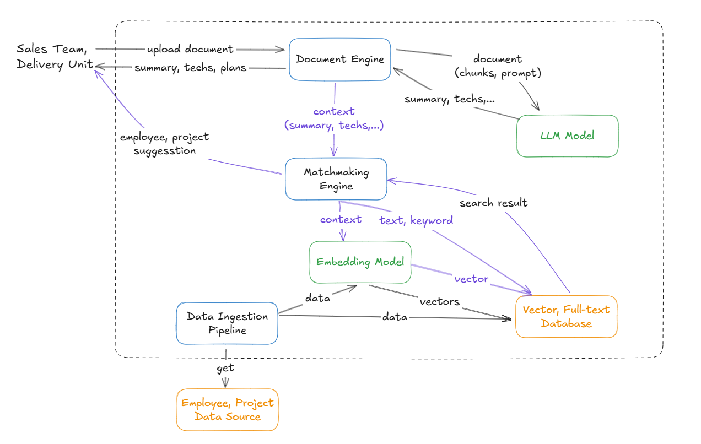
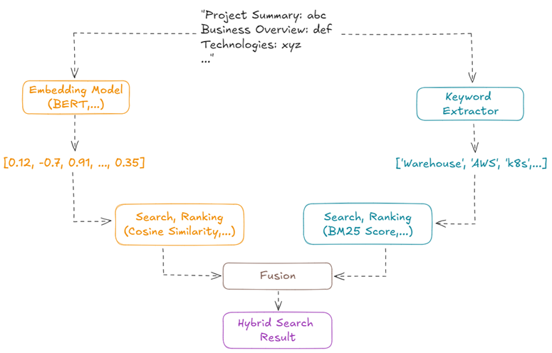

# BidBridge - AIgoristics Team

This is MVP source code for DX BOOTCAMP 2024 competition.

(Follow instruction in FE and BE components to run the application)

## Why BidBridge?

BidBridge aims to streamline the bidding process by processing RFPs to generate project summaries, recommend relevant technologies and skills, match employees to suitable roles, and create detailed work breakdown structures with estimates. By leveraging advanced AI and LLM models, BidBridge simplifies project planning, enhances team alignment, and accelerates bid preparation.

## High Level Architecture

Main components:
- LLM models
- Embedding models
- Vector database and full-text search database

## Techniques Insight

These main techniques are used to efficiently process and analyze complex bidding specifications.

- **Chunking** is used to divide large documents into manageable sections, ensuring comprehensive processing without exceeding model limitations.
- **Prompt engineering** optimizes the input to the LLM, improving accuracy in summarization and recommendations.
- **Hybrid search** combines vector and keyword-based methods to enhance the retrieval of relevant information.

Based on the data we receive, these techniques can be adjusted or fine-tuned to adapt to the specific requirements of each RFP, ensuring accurate outputs that align with evolving business needs.

## Infrastructure Design

For full development, we plan to use AWS serverless architecture to ensure scalability, cost-effectiveness, and efficient resource utilization. 

The key components of the infrastructure include:
- **Frontend**
	- Hosted on  Amazon S3 with CloudFront for delivering a responsive web interface to users.
	- Enables uploading RFP files, viewing summaries, and interacting with recommendations.
- **Backend**
	- AWS Lambda functions handle backend logic, such as processing RFPs, interacting with the LLM API, and performing data transformations.
	- Amazon API Gateway provides secure and scalable endpoints for communication between the frontend and backend.
	- AWS Glue, AWS Step Functions, AWS Lambda for data ingestion(employee, project,...)
- **Data Storage and Processing**
	- Amazon S3 for storing uploaded RFP files and generated outputs like summaries, WBS, and recommendations.
	- Amazon DynamoDB or Amazon RDS (PostgreSQL) for maintaining metadata, user preferences, and historical project information.
- **Machine Learning and AI Integration**
	- Leveraging OpenAI API for LLM-based summarization, recommendations, and natural language processing.
	- AWS Lambda functions integrate with the LLM and handle data pre- and post-processing.
- **Search Capabilities**
	- Amazon OpenSearch Service for hybrid search functionality, combining keyword and vector-based search to enhance information retrieval.
	
For this MVP development, we just simply implement FE, BE, OpenSearch on a server to desmonstrate how core functions work.